# Wounds
### It's like chess, but no check, checkmate, castling, or pawns.

## Privacy Policy

We don't share any of your information.

## Contact Me

<a href="mailto:ericfordconsulting@gmail.com">Send email to ericfordconsulting@gmail.com</a>

## How to Play

### Movement

Piece are maps of their movement capabilities. They are made up of prongs.

This piece is called a Star. They take the place of pawns in this game.

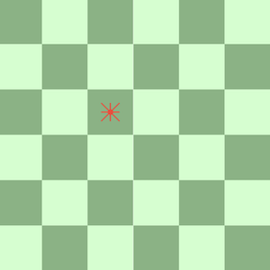

When you tap a piece, its legal moves get highlighted.

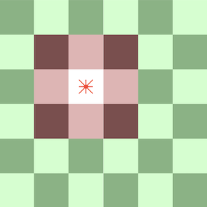

The star has short prongs, which allow a move of one square in the direction the prong is pointing. Pieces can also have long prongs. Here is a rook:

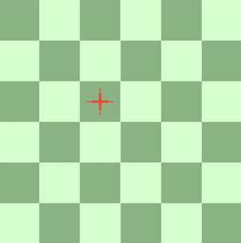

Long prongs can slide in the direction they are pointing until they hit an obstruction.

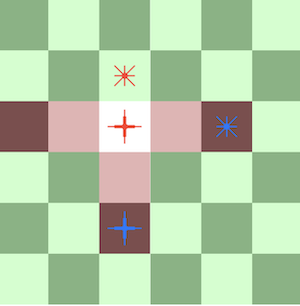

The rook can't move onto the square of the star above it since they are on the same team. It can move to either of the blue pieces' squares, but not past them. The last obstruction is the edge of the board on the west (left) side.

Then there are the knights:

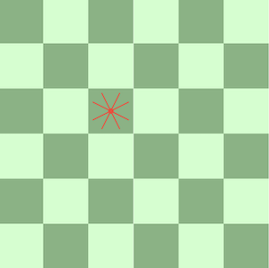

Knights move in an L shape, 2 squares north south east or west, then one square sideways from that.

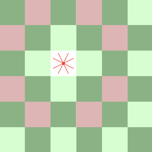

Knights can jump over other pieces. Here's a surrounded knight:

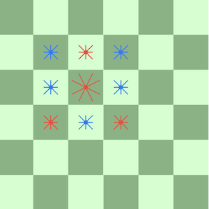

None of those pieces stop the knight from moving.

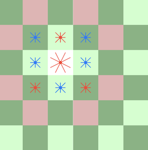

Lastly we also have fat prongs. The king has fat prongs:

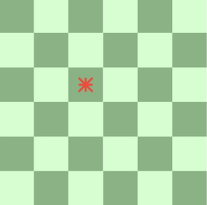

The fat prongs don't affect movement. The king moves the same as a star.

The fat prongs affect wounding, which is the next topic:

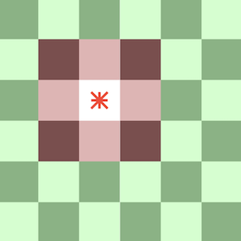

### Wounding

When a piece moves onto the square occupied by an enemy, then enemy is captured UNLESS… it has an opposing prong facing directly into the attack.

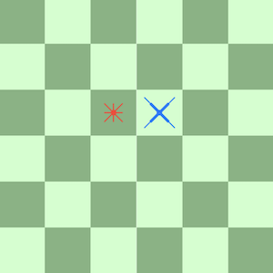

Here the star can capture the bishop, since the bishop doesn't have a prong pointing directly at the star.

The defending prong must be as strong as the attacker. So a long prong attacking a short prong still gets to capture the piece.

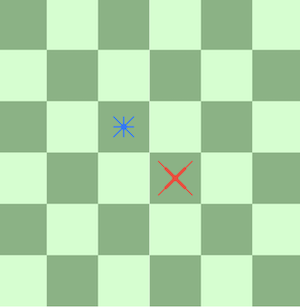

Here the bishop can capture the star since the bishop's prong is longer.

Here the bishops' prongs are of equal strength.

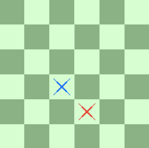

When prongs are of equal strength, the attacker removes the defender's prong.

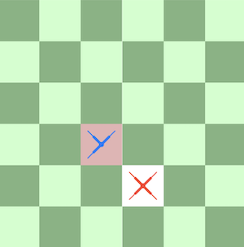

Once that prong is removed, the bishop can't move in that direction.

If the attacking prong is weaker than the defending prong, the defending prong gets shortened.

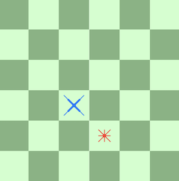

Then, after the bishop gets wounded:

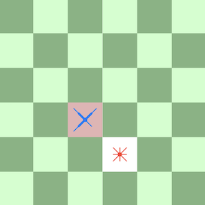

Now the prong is short instead of long; the bishop can only move one square at a time in that direction.

### Rotation

Once a piece has been wounded, it is allowed to be rotated, which takes up that player's turn the way any other move would. There are Rotate Left and Rotate Right buttons which are enabled when you select a wounded piece.

### Winning the Game

You must capture every enemy piece to win. Note that Boot Camp will take you through several levels before the game ends.